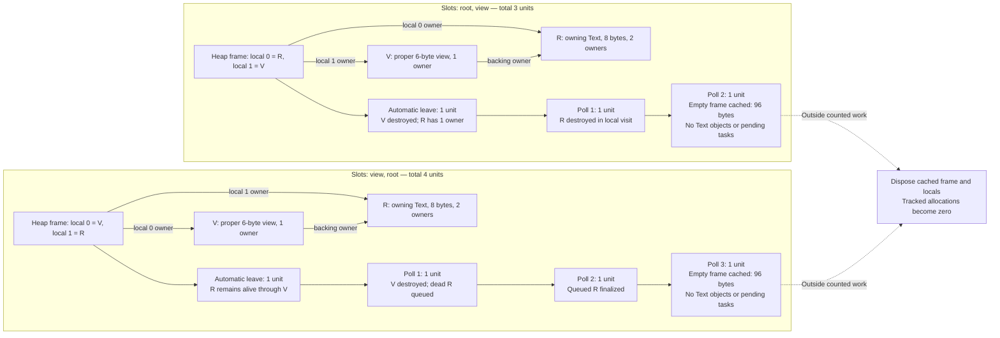

# Executed two-owner Text cleanup demand

The smallest source-proposed owner-order control reproduced **three versus four total cleanup units** at K1. Final [run-vlxdii3h](evidence/runtime-text-owner-demand/run-vlxdii3h/results.json) passed native O2 and C ASan+UBSan O1 for both orders, following a successful red observer calibration. Production and captured runtime sources remained unchanged. This is a bounded source-correspondence test of the [read-only demand derivation](runtime-demand-certificate.md), not an implemented demand ledger, verified theorem, general model campaign or timing result.

[Preregistration](runtime-text-owner-demand-preregister.json), [durable archive](evidence/runtime-text-owner-demand/run-vlxdii3h/archive-index.json), [C fixture](../../tests/memory-research-text-owner-demand.c) and [runner](../../tests/memory-research-text-owner-demand.py) preserve the declared inputs, exact commands and complete observations. Three builds and five runs comprise the final cohort: one O2 observer mutant, two native owner orders and two sanitized orders. LeakSanitizer is disabled; no generated code is tested. Darwin Clang/sanitizer libraries are external reproduction prerequisites.

Each fresh process uses public heap-frame entry with two slots, copies `abcdefgh` into an owning Text, creates the proper view `bcdefg` by slicing positions 1 through 7, and transfers the existing producer owners through `local_take(0)` then `local_take(1)`. The root has two physical owners, the view one; written sparse indices are `[0,1]` in either case. There are no temporaries, other mortal roots, preexisting debt or cached frames. The view path is asserted directly; the eight-byte root cannot hit the large-root tiny-copy threshold. Independent byte/scalar checks precede closure.

The supported ABI gives root object/data requests 48/17 bytes, view object 48, heap frame 64 and local/index storage 32. Initial RC requested bytes are 113 and tracked heap allocations five in both cases. The Text object destruction observer compares saved integer generation addresses, reads no freed object, and introduces no managed allocations or service calls.

| Local slots, then reverse retirement | Operation | Returned/automatic work | Pending tasks | Live Text objects |
| --- | --- | ---: | ---: | ---: |
| root, view | automatic leave visits view | 1 | 1 | 1 |
| root, view | explicit poll visits root | 1 | 1 | 0 |
| root, view | explicit poll finalizes frame | 1 | 0 | 0 |
| view, root | automatic leave visits root | 1 | 1 | 2 |
| view, root | explicit poll visits view and queues root | 1 | 2 | 1 |
| view, root | explicit poll finalizes queued root | 1 | 1 | 0 |
| view, root | explicit poll finalizes frame | 1 | 0 | 0 |

The first order destroys the root inline in its own local visit. The second destroys the view after the direct root owner is gone, so that view visit queues a separate root-finalization task. Both destroy each generation exactly once, satisfy per-poll K1 and destruction bounds, and recover zero objects/requested bytes. Frame finalization retains exactly 96 requested bytes in one empty cached frame and two tracked allocations. Explicit test-only cache disposal occurs **outside** the reported structural work and recovers tracked allocations to zero.

The diagram contrasts separate initial slot orders and the exact observed K1
sequence. The backing edge is an owner of the root; the cached frame is raw
storage after all Text owners are gone. It does not assert complete-state
equality between the two orders.

The red observer deliberately omitted the automatic leave work. It completed semantic and allocation recovery but computed two units for the first order; the independent total-three criterion rejected it with exit 70 and the specific `include automatic leave work` diagnostic. This is observer calibration, not a runtime defect. An earlier [successful prototype](evidence/runtime-text-owner-demand/run-ynjpxogh/results.json) stored destruction IDs as pointers; the final replay uses `uintptr_t` IDs to avoid evaluating stored pointer values after destruction. That prototype remains distinct rather than being silently replaced.

The aggregate cohort counts `V=2,F=1,Q=0,R=1` and allocation multiset agree, while owner-slot order differs. The observed values fit the proposed interval `[V+F+Q,V+F+Q+R]=[3,4]` and falsify an exact prediction from those aggregate counts alone. They do not falsify an order-aware simulation, certify open arrivals/promotion accounting, establish allocation admission, or prove closure for arbitrary generated callers. No conservative ledger, metadata, collector policy or language syntax was added.

The [independent demand audit](runtime-demand-certificate-audit.md) retains the
conditional identity with important implementation boundaries. A global ledger
must track a uniformly identified universe: Text and Bytes share a layout/kind,
so selective intermingled Bytes exclusion cannot be inferred from that header.
Direct release and `rc_step` also require their own accounting; `rc_step` may
retire active temporaries before polling. This tiny closure explicitly contains
only asserted Text root/view owners and uses frame leave plus polls, so it does
not solve either global-universe or open-operation problem. The auditor's frozen
record did not locate this differently named archive and credited only reported
totals; the exact paths above provide later reconciliation, without adding
retrospective execution/inspection credit to that static audit.

The later [compiler local-closure source case](runtime-compiler-closure-case.md)
independently located and inspected all 34 records in the final tiny archive and
reconciled the destruction observer with the production fragment. It adds
source/IR-derived conditional four-unit local demand for a different real texture
function, with caller Bytes escape explicitly outside that local component.
That report performed no new execution; neither its derivation nor its archive
inspection turns this native 3/4 observation into a generated whole-process
closure certificate.
